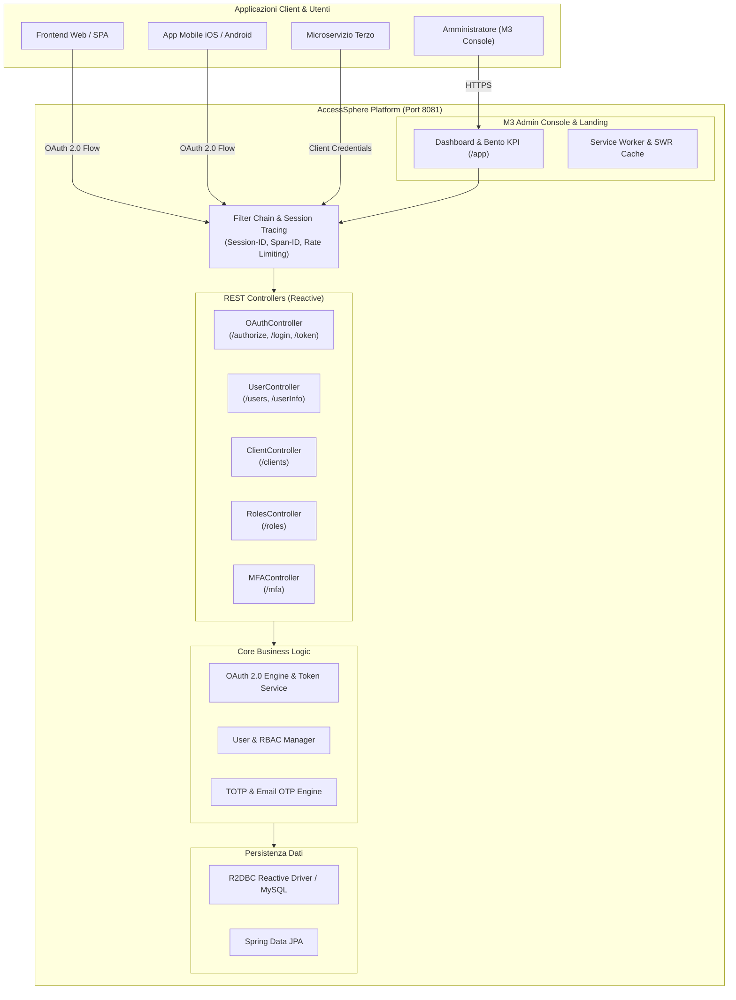

<p align="center">
  <a href="https://github.com/giovannilamarmora/Access-Sphere">
    
  </a>
</p>

<h1 align="center">🎡 AccessSphere API & Identity Console</h1>

<p align="center">
  <b>Enterprise OAuth 2.0 Authorization Server, Identity & Access Management (IAM) and Material Expressive 3 Console</b>
</p>

<p align="center">
  <a href="pom.xml"></a>
  <a href="https://jdk.java.net/22/"></a>
  <a href="https://spring.io/projects/spring-boot"></a>
  <a href="https://projectreactor.io/"></a>
  <a href="https://datatracker.ietf.org/doc/html/rfc6749"></a>
  <a href="LICENSE"></a>
</p>

> **AccessSphere** è una piattaforma enterprise-grade di **Identity & Access Management (IAM)** e **Authorization Server OAuth 2.0 / OIDC** ad alte prestazioni. Progettata per proteggere microservizi e applicazioni web/mobile, offre flussi di autenticazione robusti, gestione MFA (TOTP ed Email OTP), controllo accessi RBAC capillare, tracciamento distribuito delle sessioni e una console di amministrazione moderna basata su **Material Expressive 3 (M3)**.

---

## 🌟 **Caratteristiche Principali**

- 🔐 **OAuth 2.0 RFC 6749 Compliance**: Supporto nativo per i principali grant type (`authorization_code`, `client_credentials`, `refresh_token`), Token Introspection e Token Revocation.
- 🛡️ **Multi-Factor Authentication (MFA / 2FA)**: Supporto flessibile per TOTP (Google Authenticator, Authy) con codici QR dinamici e verifica OTP via email, configurabile sia a livello di singolo client che per utente.
- 👥 **Gestione Utenti (IAM)**: Registrazione sicura, hashing crittografico delle credenziali, gestione profili con avatar, blocco/sblocco account e convalida formati conformi agli standard di sicurezza.
- 🎛️ **Role-Based Access Control (RBAC)**: Assegnazione ruoli granulari per specifica applicazione OAuth2 o globali di sistema.
- ⚡ **Architettura Reattiva & High Throughput**: Costruito su **Spring Boot 3.4** e **Spring WebFlux** (Project Reactor) con driver reattivo **R2DBC** e supporto JPA / Hibernate.
- 🔍 **Tracciamento Distribuito della Sessione**: Propagazione automatica di `Session-ID` e `Span-ID` (Correlation ID) per il monitoraggio end-to-end delle richieste su architetture a microservizi.
- 💎 **Console di Amministrazione Material Expressive 3**:
  - Single Page Application (SPA) a 0ms di latenza con navigazione istantanea tra Dashboard, Utenti e Client.
  - Caching locale **Stale-While-Revalidate (SWR)** per visualizzazione immediata di tabelle e KPI senza blocchi UI.
  - Design Bento Glassmorphism con palette M3 profonda (`#0E0B16` / `#231B34`) e accenti viola vibranti.
- 📱 **Progressive Web App (PWA)**: Supporto offline tramite Service Worker dedicato, manifest PWA e asset multi-risoluzione.
- 📖 **Documentazione Interattiva OpenAPI / Swagger 3.0**: Esplorazione e test immediato delle API tramite Swagger UI integrata.

---

## 🏗️ **Architettura del Sistema**



---

## 🚀 **API Reference**

La documentazione OpenAPI 3.0 completa e interattiva è disponibile a runtime all'indirizzo:
👉 **`http://localhost:8081/swagger-ui.html`** (oppure endpoint JSON: **`/api-docs`**)

### 1. 🔐 **OAuth 2.0 Controller** (`/v1/oAuth/2.0`)

| Metodo | Endpoint | Descrizione | Autenticazione |
|---|---|---|---|
| `GET` | `/v1/oAuth/2.0/authorize` | Avvia il flusso di autorizzazione OAuth 2.0 (RFC 6749) | Parametri Client |
| `GET` | `/v1/oAuth/2.0/login/{client_id}` | Esegue il login dell'utente associato al client OAuth2 | Pubblico |
| `POST` | `/v1/oAuth/2.0/token` | Genera o rinnova il Bearer Token (Authorization Code o Refresh Token) | Basic / Client Credentials |
| `POST` | `/v1/oAuth/2.0/token/exchange` | Scambio credenziali client per token applicativo | Client Secret |
| `GET` | `/v1/oAuth/2.0/check-token` | Introspezione e validazione di un token attivo | Bearer Token |
| `POST` | `/v1/oAuth/2.0/revoke-token` | Revoca immediata di un token o refresh token | Bearer Token |
| `POST` | `/v1/oAuth/2.0/logout` | Disconnessione e invalidazione della sessione | Bearer Token |

### 2. 👤 **User Controller** (`/v1/users` & `/userInfo`)

| Metodo | Endpoint | Descrizione | Autenticazione |
|---|---|---|---|
| `GET` | `/userInfo` | Recupera il profilo e i claims dell'utente autenticato | Bearer Token |
| `GET` | `/v1/users/list` | Elenco di tutti gli utenti registrati | Bearer (Admin) |
| `POST` | `/v1/users/register` | Registrazione di una nuova identità utente | Client ID |
| `PUT` | `/v1/users/update` | Aggiornamento dati anagrafici e recapiti dell'utente | Bearer Token |
| `DELETE` | `/v1/users/delete/{identifier}` | Eliminazione sicura di un account utente | Bearer (Admin) |
| `POST` | `/v1/users/profile/photo` | Caricamento e aggiornamento foto profilo | Bearer Token |
| `POST` | `/v1/users/change/password/request` | Richiesta codice di reset password via email | Pubblico / Rate-limited |
| `POST` | `/v1/users/change/password` | Convalida reset e impostazione nuova password | Pubblico / Rate-limited |

### 3. 🔑 **Client Controller** (`/v1/clients`)

| Metodo | Endpoint | Descrizione | Autenticazione |
|---|---|---|---|
| `GET` | `/v1/clients` | Elenco di tutti i client OAuth2 registrati | Bearer (Admin) |
| `GET` | `/v1/clients/{clientId}` | Dettagli di configurazione del singolo client | Bearer (Admin) |
| `POST` | `/v1/clients` | Registrazione di un nuovo client applicativo | Bearer (Admin) |
| `PUT` | `/v1/clients/{clientId}` | Modifica impostazioni, redirect URIs, scadenze e flag MFA | Bearer (Admin) |
| `DELETE` | `/v1/clients/{clientId}` | Revoca e cancellazione di un client OAuth2 | Bearer (Admin) |

### 4. 🛡️ **Roles & RBAC Controller** (`/v1/roles`)

| Metodo | Endpoint | Descrizione | Autenticazione |
|---|---|---|---|
| `GET` | `/v1/roles` | Elenco di tutti i ruoli definiti nel sistema | Bearer (Admin) |
| `GET` | `/v1/roles/user/{identifier}` | Ruoli assegnati all'utente per applicazione | Bearer Token |
| `POST` | `/v1/roles/assign` | Assegna o revoca ruoli operativi a un utente | Bearer (Admin) |

### 5. 📲 **MFA Controller** (`/v1/mfa`)

| Metodo | Endpoint | Descrizione | Autenticazione |
|---|---|---|---|
| `POST` | `/v1/mfa/generate` | Genera secret TOTP e QR code per Authenticator | Bearer Token |
| `POST` | `/v1/mfa/verify` | Verifica e attiva il codice TOTP a 6 cifre | Session / Bearer |
| `POST` | `/v1/mfa/send-otp` | Invia codice monouso OTP all'indirizzo email | Session / Bearer |
| `POST` | `/v1/mfa/disable` | Disabilita l'autenticazione a due fattori sull'account | Bearer Token |

---

## 🛠️ **Requisiti di Sistema**

- **Java Development Kit (JDK)**: `22` (raccomandato Corretto 22 o OpenJDK 22)
- **Spring Boot**: `3.4.0`
- **Database**: MySQL 8.0+ / MariaDB (o database R2DBC-compatibile)
- **Maven**: `3.9+` (oppure wrapper integrato `./mvnw`)

---

## 💻 **Installazione e Avvio Rapido**

### 1. Clonare il Repository
```bash
git clone https://github.com/giovannilamarmora/Access-Sphere.git
cd Access-Sphere
```

### 2. Configurare le Proprietà del Database
Modificare `src/main/resources/application.yml` configurando la connessione JDBC ed R2DBC:
```yaml
server:
  port: 8081

spring:
  datasource:
    url: jdbc:mysql://localhost:3306/access_sphere
    username: root
    password: your_password
  r2dbc:
    url: r2dbc:mysql://localhost:3306/access_sphere
    username: root
    password: your_password
```

### 3. Compilare ed Eseguire l'Applicazione
Assicurarsi che la variabile d'ambiente `JAVA_HOME` punti a un'installazione di JDK 22:

**Linux / macOS:**
```bash
./mvnw clean spring-boot:run
```

**Windows (PowerShell):**
```powershell
$env:JAVA_HOME = "C:\Users\<User>\.jdks\corretto-22.0.2"
.\mvnw.cmd clean spring-boot:run
```

Una volta avviata l'applicazione:
- 🌐 **Landing Page**: `http://localhost:8081/`
- 🔐 **Login & Autenticazione**: `http://localhost:8081/app/login`
- 📊 **M3 Admin Console**: `http://localhost:8081/app`
- 📑 **Swagger UI Docs**: `http://localhost:8081/swagger-ui.html`

---

## 💎 **Interfaccia e Console Material Expressive 3**

La console di amministrazione è accessibile al percorso `/app`:

- **Bento Recap Dashboard**: Metriche in tempo reale con contatori dinamici (Utenti Totali, Amministratori, Nuovi Iscritti Oggi, Client OAuth2 Attivi, Session-ID di correlazione).
- **Session Tracing Completo**: Visualizzazione dell'intero identificatore di sessione (`Session-ID`) e correlazione `Span-ID` senza troncamento, con selezione rapida al click.
- **Navigazione Istantanea 0ms**: Sistema SPA con switch seamless tra Panoramica, Directory Utenti e Catalogo Client senza ricaricare la pagina web.
- **Cache Stale-While-Revalidate (SWR)**: Persistenza client-side in `localStorage` per rendering immediato a 0ms e background revalidation automatica.
- **Input M3 Restyled**: Campi input con superfici dark glass elevata (`#231B34`), bordi viola chiaro a 1.5px, selezione file personalizzata a gradiente e bottoni pillola coordinati (`.m3-btn-primary`, `.m3-btn-outline`).

---

## 🔒 **Sicurezza e Tracciamento Distribuito**

AccessSphere integra filtri HTTP avanzati per la massima protezione applicativa:

1. **Request/Response Logging & Time Tracking**: Registrazione asincrona dei tempi di esecuzione tramite l'intercettore `@Logged` e `@LogInterceptor`.
2. **Rate Limiting**: Protezione contro attacchi brute-force sugli endpoint critici (richiesta reset password, cambio credenziali).
3. **Session ID & Correlation Tracking**: Generazione automatica di `Session-ID` univoco su flussi `/authorize` e registrazione, propagato negli header delle risposte.
4. **Mascheramento Dati Sensibili**: Mascheramento automatico nei log di password, token JWT, secret key e codici OTP.

---

## 📄 **Licenza & Copyright**

Copyright &copy; 2026 **Access Sphere**. Tutti i diritti riservati.

Questo progetto è distribuito sotto licenza **Apache License 2.0**. Per maggiori informazioni consultare il file [LICENSE](LICENSE).

---

## 👨‍💻 **Autore**

Realizzato e mantenuto da **[Giovanni Lamarmora](https://github.com/giovannilamarmora)**.
Per domande, segnalazioni o contributi aprire una issue o una pull request sul repository ufficiale.