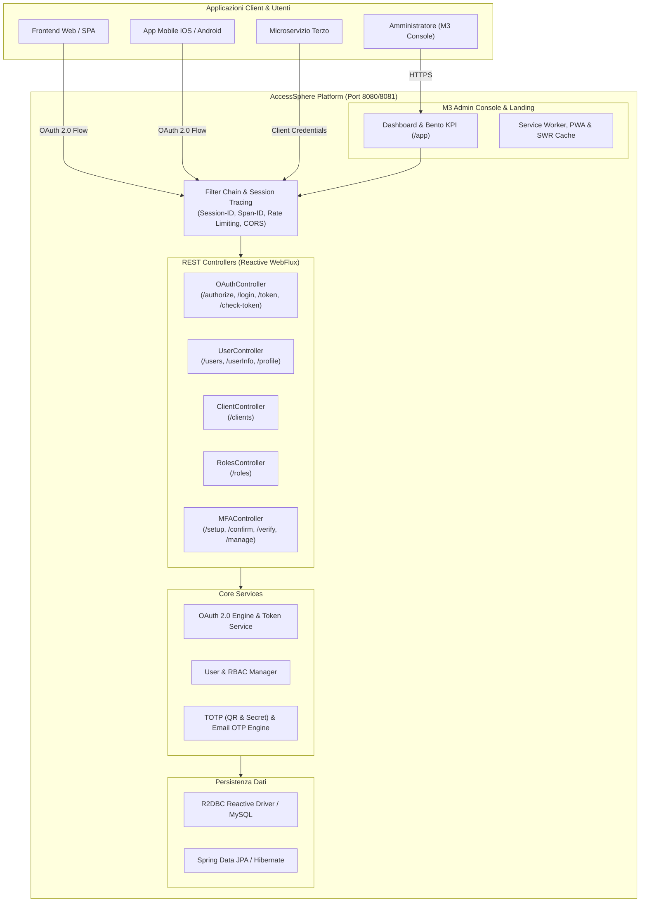

<p align="center">
  <a href="https://github.com/giovannilamarmora/Access-Sphere">
    
  </a>
</p>

<h1 align="center">🎡 AccessSphere API & Identity Console</h1>

<p align="center">
  <b>Enterprise OAuth 2.0 Authorization Server, Identity & Access Management (IAM) and Material Expressive 3 Console</b>
</p>

<p align="center">
  <a href="pom.xml"></a>
  <a href="https://jdk.java.net/22/"></a>
  <a href="https://spring.io/projects/spring-boot"></a>
  <a href="https://projectreactor.io/"></a>
  <a href="https://datatracker.ietf.org/doc/html/rfc6749"></a>
  <a href="LICENSE"></a>
</p>

> **AccessSphere** è una piattaforma enterprise-grade di **Identity & Access Management (IAM)** e **Authorization Server OAuth 2.0 / OIDC** ad altissime prestazioni. Progettata per proteggere ecosistemi di microservizi, applicazioni web e mobile, offre flussi di autenticazione robusti, gestione MFA multi-canale (TOTP con nuovo logo QR e setup manuale, Email OTP), controllo accessi RBAC granulare, tracciamento distribuito delle sessioni e una console di amministrazione moderna basata su **Material Expressive 3 (M3)** completamente responsive.

---

## 🌟 **Caratteristiche Principali**

- 🔐 **OAuth 2.0 RFC 6749 Compliance**: Supporto completo per i flussi `authorization_code`, `client_credentials`, `refresh_token`, Token Introspection (`/check-token`), Token Revocation (`/revoke-token`) e Token Exchange.
- 🛡️ **Multi-Factor Authentication (MFA / 2FA)**:
  - **TOTP RFC 6238**: Compatibilità universale (Google Authenticator, Microsoft Authenticator, 1Password, Authy).
  - **QR Code Dinamico con Brand Logo**: Incorpora il nuovo logo Access Sphere ad alta definizione al centro del QR Code su base bianca protettiva con tolleranza d'errore `ErrorCorrectionLevel.H`.
  - **Configurazione Manuale (Senza QR Code)**: Opzione dedicata per utenti su smartphone o senza fotocamera, con chiave segreta Base32 in formato monospace, pulsante di copia rapida a 1-click e istruzioni dettagliate.
  - **Email OTP**: Invio codici di verifica effimeri all'indirizzo email dell'utente.
- 👥 **Gestione Identità (IAM) & Attributi Custom**:
  - Registrazione sicura con validazione avanzata dei formati.
  - Gestione profili con caricamento foto e avatar dinamico.
  - **Attributi Custom Avanzati**: Supporto sia per chiavi/valori semplici che per **strutture JSON complesse (oggetti annidati)**, con layout a griglia responsive ottimizzato per smartphone e desktop.
- 🎛️ **Role-Based Access Control (RBAC) & Client OAuth2**:
  - Configurazione granulare dei ruoli applicativi e di sistema.
  - Gestione completa dei Client OAuth2: redirect URIs, scope, webhook e assegnazione ruoli.
  - Interfaccia mobile-first con pulsanti e switch a pillola disposti verticalmente senza tagli di testo.
- ⚡ **Architettura Reattiva & High Throughput**: Costruito su **Spring Boot 3.4** e **Spring WebFlux** (Project Reactor) con driver reattivo **R2DBC** e JPA / Hibernate.
- 🔍 **Tracciamento Distribuito della Sessione**: Propagazione automatica di `Session-ID` e `Span-ID` (Correlation ID) per il monitoraggio end-to-end delle richieste su architetture a microservizi.
- 💎 **Console di Amministrazione Material Expressive 3**:
  - Single Page Application (SPA) a 0ms di latenza con navigazione fluida tra Panoramica, Utenti e Client.
  - **Auto Scroll-to-Top**: Ripristino automatico e immediato della vista in cima alla pagina (`Y = 0`) ad ogni cambio sezione o navigazione browser.
  - Caching locale **Stale-While-Revalidate (SWR)** per visualizzazione istantanea di tabelle e KPI.
  - Design Bento Glassmorphism con layout ultra-wide e accenti reattivi.
- 🎨 **Motore Multi-Palette & Temi Dinamici a 360°**:
  - 6 armonie cromatiche Material Expressive 3: **Cosmic Purple** (Default), **Midnight Ocean**, **Emerald Matrix**, **Amber Sunset**, **Titanium Slate** e **Crimson Cyber**.
  - Propagazione istantanea del tema all'intera piattaforma: Landing page (inclusa la scena 3D Three.js interattiva), schermata di login, dashboard e tutte le sezioni di gestione.
- 🏷️ **White-Labeling & Personalizzazione Branding**:
  - Configurazione a runtime di Logo aziendale, Favicon, Nome Piattaforma, Tagline, Footer Copyright e Support Email.
  - Personalizzazione della schermata di Login: scelta tra Cinematic Showcase predefinito o Immagine di sfondo personalizzata con opacità regolabile e titoli dinamici.
- 💾 **Backup & Restore Completo a 1-Click**:
  - Esportazione istantanea dell'intero database (utenti, credenziali, ruoli, client OAuth2, impostazioni) in un unico file JSON strutturato.
  - Procedura di ripristino con validazione schema e zero downtime per migrazioni e disaster recovery.
- 🌐 **Internazionalizzazione (i18n) & Zero-Flicker Rendering**:
  - Supporto completo per Italiano e Inglese con 330+ chiavi di traduzione (Landing page, Login, Dashboard, Gestione Utenti, Gestione Client, Modali ed Error Code).
  - Selezione flessibile della lingua: **Automatico (Browser)** con fallback intelligente, oppure forzatura manuale (**Italiano** o **English**).
  - Rendering istantaneo senza sfarfallio (FOUC) tramite cache sincrona e CSS anti-flicker guard.
- 🚀 **Technical Seed & Bootstrap Automatico**:
  - Creazione automatica all'avvio a DB vuoto dell'utenza tecnica e del client tecnico OAuth2 configurabili da variabili d'ambiente.
- 📱 **Progressive Web App (PWA)**: Supporto offline tramite Service Worker dedicato, manifest PWA e asset multi-risoluzione.
- 📖 **Documentazione Interattiva OpenAPI / Swagger 3.0**: Esplorazione e test immediato delle API tramite Swagger UI integrata.

---

## 🏗️ **Architettura del Sistema**



---

## ⚙️ **Configurazione & Variabili d'Ambiente (ENV)**

L'applicazione può essere configurata tramite variabili d'ambiente di sistema, file `.env` (per Docker Compose) o profili Spring (`application.yml` / `application-deploy.yml`).

È disponibile un template pronto all'uso nel file [`.env.example`](.env.example):
```bash
cp .env.example .env
```

### 📋 **Elenco Completo delle Variabili d'Ambiente**

| Variabile d'Ambiente | Obbligatoria | Valore Predefinito | Descrizione |
|---|:---:|---|---|
| **`SPRING_PROFILES_ACTIVE`** | No | `deploy` | Profilo Spring attivo (`local`, `deploy`, `test`). Nel profilo `deploy` le proprietà vengono caricate da `application-deploy.yml`. |
| **`APP_ENV`** | No | `Production` | Nome dell'ambiente applicativo (`Local`, `Development`, `Staging`, `Production`), visualizzato nei log e nella dashboard. |
| **`PORT`** | No | `8080` (container) / `8081` (local) | Porta TCP di ascolto del server HTTP. |
| **`COOKIE_DOMAIN`** | No | `localhost` | Dominio impostato nei cookie di sessione HTTP (`Set-Cookie`). In produzione specificare il dominio (es. `.tuodominio.com`). |
| **`TZ`** | No | `Europe/Rome` | Fuso orario del runtime Java e del container Docker. |
| **`DATABASE_JDBC_URL`** | **Sì** | `jdbc:mysql://localhost:3306` | URL di connessione JDBC per il database MySQL/MariaDB (senza nome schema). |
| **`DATABASE_NAME`** | **Sì** | `access_sphere` | Nome dello schema del database relazionale. |
| **`DATABASE_USERNAME`** | **Sì** | `root` | Nome utente per l'autenticazione al database. |
| **`DATABASE_PASSWORD`** | **Sì** | `root` | Password per l'autenticazione al database. |
| **`AES_KEY`** | **Sì** | - | Chiave crittografica simmetrica AES (256-bit / 32 caratteri) per cifratura/decifratura dei dati sensibili e secret applicativi. |
| **`TECH_USERNAME`** | No | `tech_admin` | Username dell'utente tecnico interno per operazioni automatizzate e batch (`ACCESS-SPHERE-TECH`). |
| **`TECH_PASSWORD`** | No | `tech_password` | Password associata all'utente tecnico interno. |
| **`LOGGING_LEVEL`** | No | `INFO` | Livello di log per il package applicativo `io.github.giovannilamarmora` (`DEBUG`, `INFO`, `WARN`, `ERROR`). |
| **`LOGBACK_FILE`** | No | `classpath:logback-spring.xml` | Percorso opzionale del file di configurazione Logback. |
| **`GCLOUD_PROJECT`** | No | - | ID progetto Google Cloud (necessario se si utilizza Google Cloud Logging). |
| **`GOOGLE_APPLICATION_CREDENTIALS`** | No | - | Percorso assoluto al file JSON delle credenziali service account Google Cloud. |
| **`STRAPI_ACTIVE`** | No | `false` | Flag booleano (`true`/`false`) per abilitare o disabilitare il bridge esterno con Strapi CMS. |
| **`STRAPI_BASE_URL`** | No | `http://app.strapi.cms:1337` | URL base delle API Strapi CMS. |
| **`STRAPI_AUTH_TOKEN`** | No | - | Token Bearer JWT per l'autenticazione delle richieste verso le API Strapi. |
| **`CORS_ENABLED`** | No | `true` | Abilita o disabilita il filtro CORS per le richieste cross-origin. |
| **`CORS_ALLOWED_ORIGINS`** | No | `*` | Origini consentite per le chiamate CORS (es. `*` o domini separati da virgola). |
| **`CORS_ALLOWED_HEADERS`** | No | `Origin, Content-Type, Accept, Authorization, Location, Trace-ID, Span-ID, Parent-ID, Registration-Token, Session-ID, Redirect-Uri` | Header HTTP consentiti nelle richieste cross-origin. |
| **`CORS_ALLOW_CREDENTIALS`** | No | `true` | Consente l'invio di cookie e credenziali autorizzative nelle chiamate CORS (`true`/`false`). |
| **`CORS_NOT_FILTER`** | No | `**/swagger-ui/**,/api-docs,**/api-docs/**` | Pattern di percorsi esclusi dal filtro CORS. |
| **`DOCKER_REPOSITORY`** | No | `giovannilamarmora/access-sphere` | Nome dell'immagine / repository Docker per build e deploy. |
| **`APP_VERSION`** | No | `latest` | Tag di versione dell'immagine Docker. |

---

## 🚀 **API Reference**

La documentazione OpenAPI 3.0 interattiva è accessibile a runtime all'indirizzo:
👉 **`http://localhost:8081/swagger-ui.html`** (oppure formato JSON: **`/api-docs`**)

### 1. 🔐 **OAuth 2.0 Controller** (`/v1/oAuth/2.0`)

| Metodo | Endpoint | Descrizione | Autenticazione |
|---|---|---|---|
| `GET` | `/v1/oAuth/2.0/authorize` | Avvia il flusso di autorizzazione OAuth 2.0 (RFC 6749) | Parametri Client |
| `GET` | `/v1/oAuth/2.0/login/{client_id}` | Esegue l'autenticazione dell'utente associato al client OAuth2 | Pubblico |
| `POST` | `/v1/oAuth/2.0/token` | Genera o rinnova il Bearer Token (`password`, `authorization_code`, `refresh_token`) | Basic / Client Secret |
| `POST` | `/v1/oAuth/2.0/token/exchange` | Scambio credenziali client per token applicativo | Client Secret |
| `GET` | `/v1/oAuth/2.0/check-token` | Introspezione e validazione di un token attivo | Bearer Token |
| `POST` | `/v1/oAuth/2.0/revoke-token` | Revoca immediata di un access token o refresh token | Bearer Token |
| `POST` | `/v1/oAuth/2.0/logout` | Disconnessione e invalidazione completa della sessione | Bearer Token |

### 2. 👤 **User Controller** (`/v1/users` & `/userInfo`)

| Metodo | Endpoint | Descrizione | Autenticazione |
|---|---|---|---|
| `GET` | `/userInfo` | Recupera il profilo e i claims dell'utente autenticato | Bearer Token |
| `GET` | `/v1/users/list` | Elenco di tutti gli utenti registrati | Bearer (Admin) |
| `POST` | `/v1/users/register` | Registrazione di una nuova identità utente | Client ID |
| `PUT` | `/v1/users/update` | Aggiornamento dati anagrafici, attributi e recapiti | Bearer Token |
| `DELETE` | `/v1/users/delete/{identifier}` | Eliminazione sicura di un account utente | Bearer (Admin) |
| `POST` | `/v1/users/profile/photo` | Caricamento e aggiornamento foto profilo | Bearer Token |
| `POST` | `/v1/users/change/password/request` | Richiesta codice di reset password via email | Pubblico / Rate-limited |
| `POST` | `/v1/users/change/password` | Convalida reset e impostazione nuova password | Pubblico / Rate-limited |

### 3. 🔑 **Client Controller** (`/v1/clients`)

| Metodo | Endpoint | Descrizione | Autenticazione |
|---|---|---|---|
| `GET` | `/v1/clients` | Elenco di tutti i client OAuth2 registrati | Bearer (Admin) |
| `GET` | `/v1/clients/{clientId}` | Dettagli di configurazione del singolo client | Bearer (Admin) |
| `POST` | `/v1/clients` | Registrazione di un nuovo client applicativo | Bearer (Admin) |
| `PUT` | `/v1/clients/{clientId}` | Modifica impostazioni, redirect URIs, scadenze, webhook e flag MFA | Bearer (Admin) |
| `DELETE` | `/v1/clients/{clientId}` | Revoca e cancellazione di un client OAuth2 | Bearer (Admin) |

### 4. 🛡️ **Roles & RBAC Controller** (`/v1/roles`)

| Metodo | Endpoint | Descrizione | Autenticazione |
|---|---|---|---|
| `GET` | `/v1/roles` | Elenco di tutti i ruoli definiti nel sistema | Bearer (Admin) |
| `GET` | `/v1/roles/user/{identifier}` | Ruoli assegnati all'utente per applicazione | Bearer Token |
| `POST` | `/v1/roles/assign` | Assegna o revoca ruoli operativi a un utente | Bearer (Admin) |

### 5. 📲 **MFA Controller** (`/v1/mfa`)

| Metodo | Endpoint | Descrizione | Autenticazione |
|---|---|---|---|
| `POST` | `/v1/mfa/setup` | Genera secret TOTP, URL `otpauth://` e QR code con brand logo | Bearer Token |
| `POST` | `/v1/mfa/confirm` | Verifica il primo codice OTP a 6 cifre e attiva definitivamente il metodo MFA | Bearer Token |
| `POST` | `/v1/mfa/verify` | Valida il codice OTP durante il login multi-fattore | Session / Bearer |
| `POST` | `/v1/mfa/manage` | Gestione metodi MFA (abilitazione, disabilitazione o rimozione: `ENABLE`, `DISABLE`, `DELETE`) | Bearer Token |

---

## 🛠️ **Requisiti di Sistema**

- **Java Development Kit (JDK)**: `22` (raccomandato Amazon Corretto 22 o OpenJDK 22)
- **Spring Boot**: `3.4.0`
- **Database**: MySQL 8.0+ / MariaDB 10.5+
- **Maven**: `3.9+` (oppure il wrapper integrato `./mvnw` / `.\mvnw.cmd`)
- **Docker & Docker Compose**: Opzionale per deploy containerizzato

---

## 💻 **Installazione e Avvio Rapido**

### Opzione A: Avvio Rapido con Docker Compose (Raccomandato)

1. Clonare il repository:
   ```bash
   git clone https://github.com/giovannilamarmora/Access-Sphere.git
   cd Access-Sphere
   ```

2. Creare il file `.env` a partire dal template:
   ```bash
   cp .env.example .env
   # Modificare le credenziali nel file .env (es. password database e AES_KEY)
   ```

3. Avviare l'applicazione con Docker Compose:
   ```bash
   docker compose up -d
   ```

---

### Opzione B: Esecuzione in Ambiente Locale con Maven

1. **Configurare le Proprietà del Database:**
   Assicurarsi che MySQL sia attivo e modificare `src/main/resources/application.yml` o impostare le variabili d'ambiente:
   ```yaml
   spring:
     datasource:
       url: jdbc:mysql://localhost:3306/access_sphere
       username: root
       password: your_password
     r2dbc:
       url: r2dbc:mysql://localhost:3306/access_sphere
       username: root
       password: your_password
   ```

2. **Compilare ed Eseguire:**
   Assicurarsi che `JAVA_HOME` punti all'installazione di JDK 22:

   **Linux / macOS:**
   ```bash
   export JAVA_HOME=/path/to/corretto-22
   ./mvnw clean spring-boot:run
   ```

   **Windows (PowerShell):**
   ```powershell
   $env:JAVA_HOME = "C:\Users\<User>\.jdks\corretto-22.0.2"
   .\mvnw.cmd clean spring-boot:run
   ```

---

### 🌐 **Punti di Accesso dell'Applicazione**

Una volta avviato il servizio:
- 🌐 **Landing Page Ufficiale**: `http://localhost:8081/`
- 🔐 **Login & Autenticazione**: `http://localhost:8081/app/login`
- 📊 **M3 Admin Console**: `http://localhost:8081/app`
- 📑 **Swagger UI Docs**: `http://localhost:8081/swagger-ui.html`
- 📄 **OpenAPI Spec (JSON)**: `http://localhost:8081/api-docs`

---

## ⚙️ **Configurazione & Bootstrap Automatico (Technical Seed)**

AccessSphere supporta l'inizializzazione automatica delle credenziali di accesso al primo avvio su database vuoto (`ProjectInitializerService`), garantendo un bootstrap istantaneo senza dover eseguire script SQL manuali:

| Variabile d'Ambiente | Proprietà Spring | Descrizione | Default |
|---|---|---|---|
| `APP_INIT_TECH_USER_USERNAME` | `application.init.tech-user.username` | Username dell'utenza tecnica con privilegi ADMIN | `giovanni_admin` |
| `APP_INIT_TECH_USER_PASSWORD` | `application.init.tech-user.password` | Password iniziale dell'utenza tecnica | `GiovanniPass123!` |
| `APP_INIT_TECH_USER_EMAIL` | `application.init.tech-user.email` | Email associata all'utenza tecnica | `admin@access-sphere.com` |
| `APP_INIT_TECH_CLIENT_ID` | `application.init.tech-client.client-id` | Client ID OAuth2 tecnico dell'applicazione | `ACCESS-SPHERE-TECH` |
| `APP_INIT_TECH_CLIENT_SECRET` | `application.init.tech-client.client-secret` | Client Secret dell'applicazione | `SphereSecretKey2026!` |

---

## 🎨 **Impostazioni Applicazione, White-Labeling & Backup**

Dal pannello delle impostazioni nella Dashboard amministrativa `/app`, gli amministratori possono gestire in tempo reale:

1. **Brand Identity & White-Labeling**:
   - Modifica istantanea di **Nome Applicazione**, **Tagline**, **Email di Supporto** e **Copyright**.
   - Caricamento dinamico del **Logo** e della **Favicon** in formato Base64.
   - Personalizzazione della schermata di Login: **Cinematic Showcase** con animazioni o **Sfondo Aziendale Custom** con slider di regolazione dell'opacità dell'overlay (`0% - 100%`) e testi hero personalizzabili.
2. **Motore Multi-Palette & Temi Material Expressive 3**:
   - Selezione dinamica tra 6 armonie cromatiche:
     - 🟣 **Cosmic Purple**: L'armonia originale elegante e profonda con accenti viola elettrico.
     - 🌊 **Midnight Ocean**: Tonalità ciano e blu profondo per ecosistemi cloud ed enterprise.
     - 🍃 **Emerald Matrix**: Verde smeraldo per ambienti di monitoraggio e compliance.
     - 🌅 **Amber Sunset**: Tonalità arancio e ambra calde ad alto impatto visuale.
     - 🪙 **Titanium Slate**: Slate bluastro sobrio e minimale ad alto contrasto.
     - 🌹 **Crimson Cyber**: Rosso cremisi futuristico per ambienti di security e NOC/SOC.
   - **Propagazione a 360°**: Il tema attivo riconfigura istantaneamente ogni pixel: Landing page, particelle e sfere 3D Three.js, schermata di Login, bottoni, card bento, tab e modali amministrative.
3. **Backup & Restore a 1-Click**:
   - **Export 1-Click**: Scarica un archivio JSON completo contenente utenti, ruoli, registrazioni client e preferenze di sistema.
   - **Ripristino Sicuro**: Carica un backup precedente per ripristinare o migrare l'intera istanza con zero downtime.
4. **Localizzazione Dinamica (i18n)**:
   - Traduzioni complete in **Italiano** e **Inglese** con oltre 260 chiavi dedicate, auto-detection della lingua del browser e switch istantaneo.

---

## 💎 **Interfaccia e Console Material Expressive 3**

La console di amministrazione `/app` include:

- **Bento Recap Dashboard**: Metriche in tempo reale con contatori dinamici (Utenti Totali, Amministratori, Nuovi Iscritti Oggi, Client OAuth2 Attivi, Session-ID di correlazione).
- **Session Tracing Completo**: Visualizzazione dell'intero identificatore di sessione (`Session-ID`) e correlazione `Span-ID` senza troncamento, con selezione rapida al click.
- **Navigazione Istantanea 0ms**: Sistema SPA con switch seamless tra Panoramica, Directory Utenti e Catalogo Client senza ricaricare la pagina web.
- **Scroll Reset Integrato**: A ogni cambio scheda o transizione vista, la pagina riposiziona istantaneamente lo scroll in cima (`Y = 0`).
- **Cache Stale-While-Revalidate (SWR)**: Persistenza client-side in `localStorage` per rendering immediato a 0ms e background revalidation automatica.
- **Responsive Mobile First**:
  - Assegnazione Ruoli e gestione Webhook con layout a 1 colonna a tutta larghezza e pulsanti touch impilati verticalmente.
  - Attributi Custom Utente strutturati a griglia responsive per oggetti complessi (JSON).
  - Configurazione MFA con wizard a passi, icona TOTP dedicata, nuovo logo nel QR Code e pannello a scomparsa per inserimento manuale della chiave segreta.

---

## 🔒 **Sicurezza e Tracciamento Distribuito**

AccessSphere integra filtri HTTP avanzati per la massima protezione applicativa:

1. **Request/Response Logging & Time Tracking**: Registrazione asincrona dei tempi di esecuzione tramite l'intercettore `@Logged` e `@LogInterceptor`.
2. **Rate Limiting**: Protezione contro attacchi brute-force sugli endpoint critici (richiesta reset password, cambio credenziali).
3. **Session ID & Correlation Tracking**: Generazione automatica di `Session-ID` univoco su flussi `/authorize` e registrazione, propagato negli header delle risposte.
4. **Mascheramento Dati Sensibili**: Mascheramento automatico nei log di password, token JWT, secret key e codici OTP.

---

## 📄 **Licenza & Copyright**

Copyright &copy; 2026 **Access Sphere**. Tutti i diritti riservati.

Questo progetto è distribuito sotto licenza **Apache License 2.0**. Per maggiori informazioni consultare il file [LICENSE](LICENSE).

---

## 👨‍💻 **Autore**

Realizzato e mantenuto da **[Giovanni Lamarmora](https://github.com/giovannilamarmora)**.  
Per domande, segnalazioni o contributi aprire una issue o una pull request sul repository ufficiale.